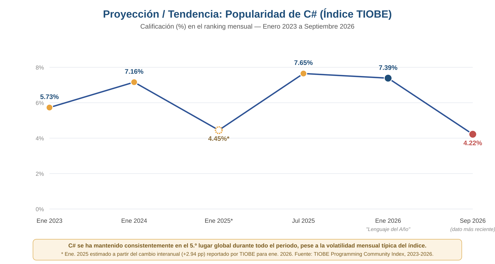
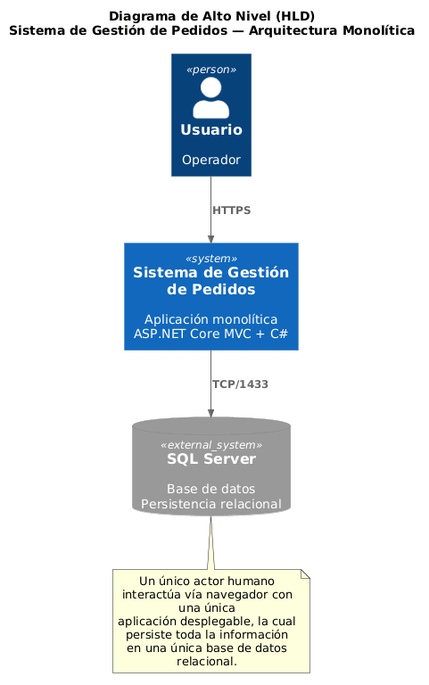
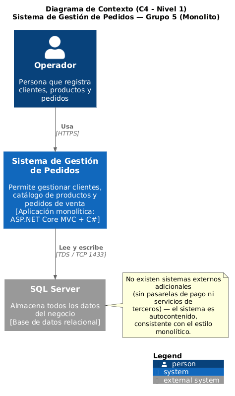
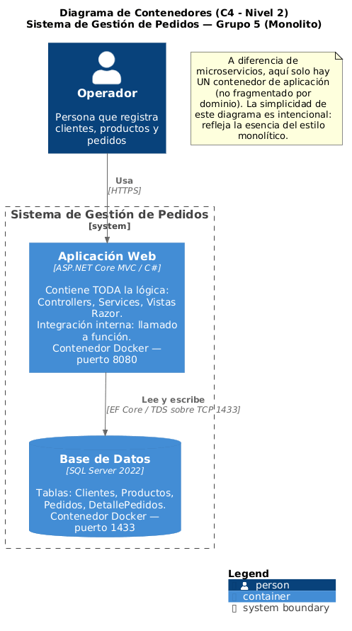
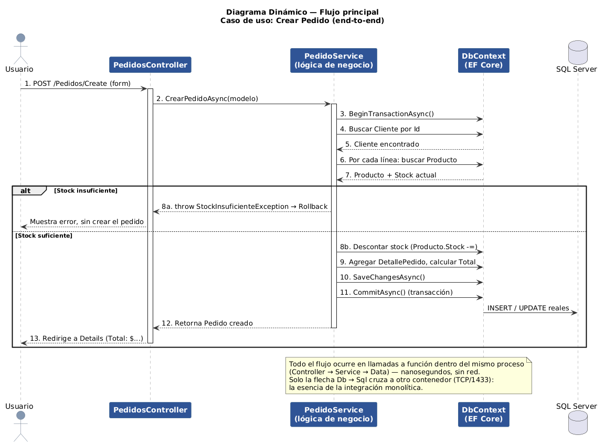
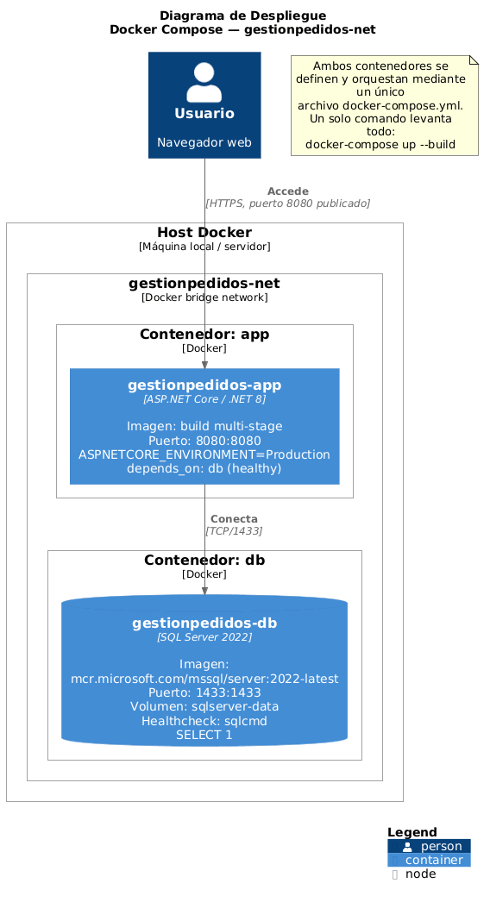
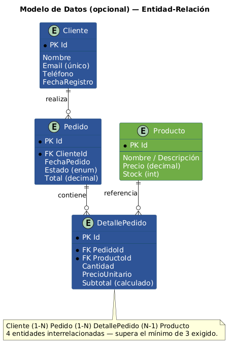
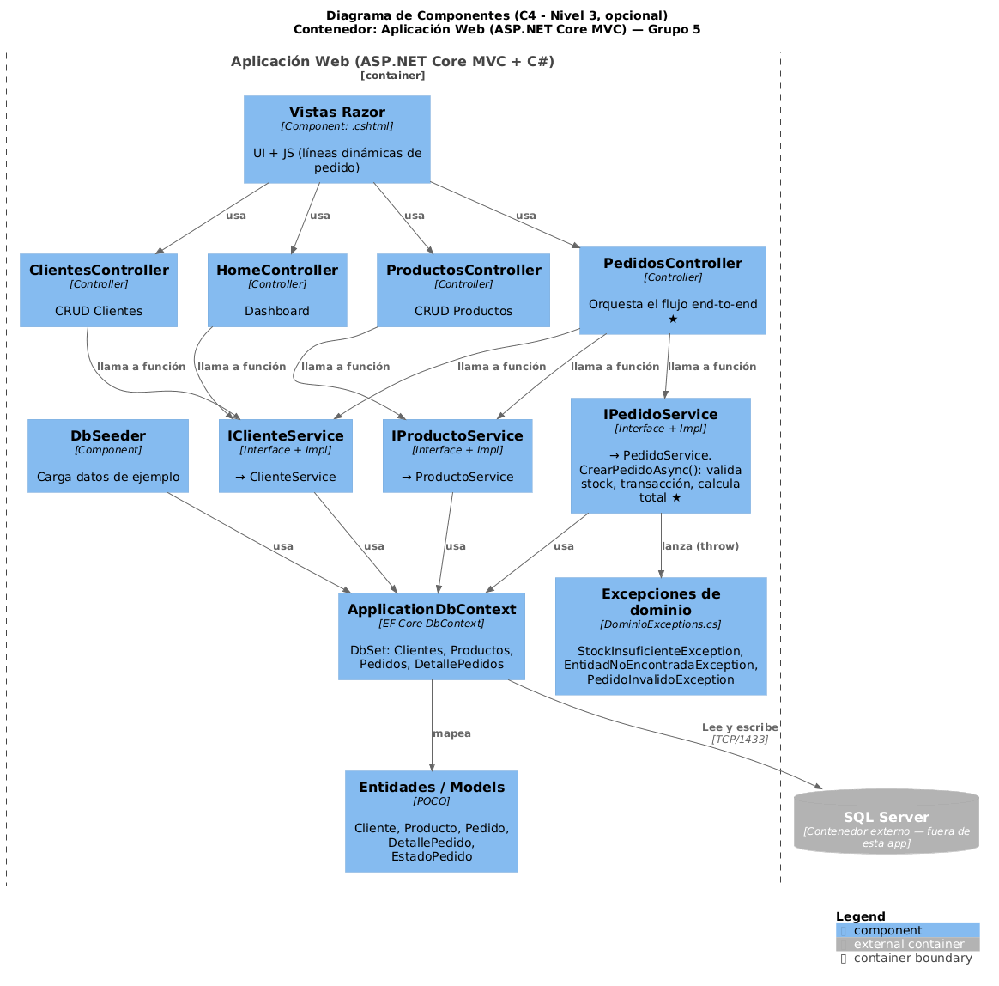

# Documento Técnico: Estilo Arquitectónico Monolítico

**Caso práctico:** Sistema de Gestión de Pedidos

**Stack:** .NET MVC / C# / MS-SQL Server

**Grupo 5**

**Integrantes:** Jose Valeriano, Camila Beltrán, Jorge Fortich

**Fecha:** Septiembre 2026

---

## Índice

1. [Investigación del Estilo Arquitectónico: Monolítico](#investigación-del-estilo-arquitectónico-monolítico)
2. [Investigación del Stack Tecnológico](#investigación-del-stack-tecnológico)
3. [Análisis Arquitectónico](#análisis-arquitectónico)
4. [Diseño — Modelo C4](#diseño--modelo-c4)
5. [Implementación](#implementación)
6. [Lecciones Aprendidas](#lecciones-aprendidas)
7. [Conclusiones](#conclusiones)
8. [Referencias](#referencias)

---

# Investigación del Estilo Arquitectónico: Monolítico

## Definición

La arquitectura monolítica es un estilo de diseño de software en el que
todos los componentes de una aplicación —la interfaz de usuario, la
lógica de negocio y el acceso a datos— se desarrollan, empaquetan y
despliegan como una única unidad ejecutable e indivisible. Todo el
código fuente reside en una sola base de código (*codebase*) y se
ejecuta dentro de un mismo proceso.

Es importante aclarar qué NO es un monolito: no es sinónimo de "mal
diseñado", "código espagueti" o "sin buenas prácticas". Un monolito bien
construido puede estar internamente modularizado en capas (presentación,
negocio, datos) o incluso en módulos de dominio bien definidos,
manteniendo alta cohesión y bajo acoplamiento interno, aunque se
despliegue como una sola unidad. A este subtipo se le conoce como
"monolito modular".

## Clasificación del estilo

Dentro de la taxonomía de estilos arquitectónicos, el monolito se
clasifica como un estilo de despliegue único (*single-deployment*), en
contraposición a los estilos distribuidos como microservicios o SOA
(Service-Oriented Architecture). Puede combinarse internamente con
patrones estructurales como:

-   **Layered Architecture** (arquitectura en capas): separación
    horizontal por responsabilidad (presentación / negocio / datos).

-   **Arquitectura Hexagonal o Clean Architecture**: separación por
    dependencia hacia el dominio, aún dentro de un único despliegue.

-   **Modular Monolith**: módulos de negocio independientes que
    comparten proceso y base de datos, pero con fronteras internas
    claras.

## Características principales

-   Un único proceso de ejecución y un único artefacto de despliegue
    (ej. un `.war`, un `.dll` compilado, un contenedor Docker).

-   Comunicación interna entre módulos mediante llamadas a
    función/método en memoria, no mediante llamadas de red.

-   Comparten una única base de datos (o esquema) para toda la
    aplicación.

-   El escalado se realiza replicando la aplicación completa (escalado
    horizontal de la unidad entera), no de partes individuales.

-   El ciclo de vida de desarrollo, pruebas y despliegue es unificado:
    un solo pipeline de CI/CD para toda la aplicación.

## Historia y evolución

El monolito no es una "nueva tendencia"; es, de hecho, la forma
predeterminada en que se construyó la mayoría del software empresarial
desde los años 70 y 80, cuando los sistemas cliente-servidor y luego las
aplicaciones web de tres capas (presentación-negocio-datos) dominaban el
desarrollo. Frameworks como Java EE, Ruby on Rails, Django y ASP.NET
(incluyendo ASP.NET MVC) nacieron con esta filosofía: entregar una
aplicación completa y cohesiva de forma rápida.

A mediados de la década de 2010, con el auge de la computación en la
nube, contenedores y la necesidad de escalar equipos grandes de forma
independiente, surgió la arquitectura de microservicios como reacción a
las limitaciones de escalabilidad organizacional de los monolitos
grandes ("big ball of mud"). Sin embargo, desde 2020 en adelante se ha
dado un movimiento de reevaluación: empresas reconocidas (Amazon Prime
Video, Segment) han documentado públicamente el retorno de componentes
de microservicios a monolitos, argumentando menor complejidad operativa
y menores costos, lo que ha revitalizado el interés en el monolito bien
diseñado como opción legítima y no como "paso intermedio obsoleto".

## Ventajas y desventajas

### Ventajas

-   **Simplicidad de desarrollo**: un único repositorio, un único
    proyecto que compilar y ejecutar localmente.

-   **Transacciones ACID sencillas**: al compartir una sola base de
    datos y proceso, garantizar atomicidad entre operaciones (como crear
    un pedido y descontar stock) es directo, sin necesidad de patrones
    complejos como Saga.

-   **Menor latencia**: las llamadas entre módulos son llamadas a
    función en memoria, no llamadas de red (sin *overhead* de
    serialización HTTP/gRPC).

-   **Despliegue y monitoreo más simples**: un solo artefacto, un solo
    lugar donde buscar logs y métricas.

-   **Curva de aprendizaje menor** para equipos pequeños o proyectos con
    presupuesto/tiempo limitado.

### Desventajas

-   **Escalabilidad limitada**: no es posible escalar solo el módulo con
    más carga; hay que escalar toda la aplicación.

-   **Alto riesgo en despliegues**: un cambio pequeño en un módulo
    requiere volver a desplegar toda la aplicación, aumentando el radio
    de impacto de un error.

-   **Acoplamiento tecnológico**: toda la aplicación debe usar el mismo
    lenguaje/framework; no es viable adoptar tecnologías distintas por
    módulo.

-   Con el crecimiento del equipo y del código, sin disciplina de
    modularización interna, tiende a degradar en un "big ball of mud"
    difícil de mantener.

-   **Menor tolerancia a fallos**: un error no controlado en un módulo
    puede tumbar toda la aplicación (no hay aislamiento de fallos como
    en microservicios).

## Problemas comunes y patrones asociados

Los problemas más frecuentes en arquitecturas monolíticas mal
gestionadas y los patrones que ayudan a mitigarlos:

-   **Problema**: acoplamiento excesivo entre capas →
    **Patrón**: Layered Architecture con interfaces bien definidas entre
    capas (como se implementó entre Controllers, Services y Data en el
    caso práctico).

-   **Problema**: lógica de negocio mezclada con el acceso a datos
    → **Patrón**: Repository Pattern y Service Layer para
    aislar la lógica de negocio del ORM.

-   **Problema**: dependencias circulares o "god classes" →
    **Patrón**: Domain-Driven Design (DDD) con módulos por dominio,
    incluso dentro del mismo despliegue (Modular Monolith).

-   **Problema**: pruebas lentas o frágiles por falta de desacoplamiento
    → **Patrón**: Inyección de Dependencias (usado en este
    proyecto vía el contenedor de servicios de .NET) para facilitar el
    uso de *mocks* en pruebas unitarias.

## Casos de uso: cuándo usarlo y cuándo no

### Cuándo usarlo

-   Equipos pequeños (2-10 desarrolladores) que necesitan iterar rápido.

-   Productos en etapa temprana (MVP) donde el dominio de negocio aún no
    está bien definido y podría cambiar drásticamente.

-   Sistemas con requisitos de consistencia transaccional fuerte entre
    distintas entidades de negocio.

-   Aplicaciones empresariales internas con carga de usuarios predecible
    y no masiva.

### Cuándo NO usarlo

-   Sistemas que requieren escalar de forma independiente componentes
    con cargas muy distintas (ej. un servicio de recomendaciones con
    alto tráfico vs. un servicio de facturación de bajo tráfico).

-   Organizaciones grandes con muchos equipos autónomos que necesitan
    desplegar de forma independiente y frecuente sin coordinarse entre
    sí.

-   Sistemas que requieren alta disponibilidad con aislamiento estricto
    de fallos entre componentes críticos y no críticos.

## Casos de aplicación reales en la industria

-   **Stack Overflow** operó durante gran parte de su historia (e
    incluso hoy en buena medida) sobre un monolito .NET, sirviendo
    millones de solicitudes diarias con muy pocos servidores gracias a
    optimización vertical.

-   **Shopify** mantiene su núcleo de comercio como un monolito modular
    en Ruby on Rails, deliberadamente, incluso después de convertirse en
    una empresa de escala masiva.

-   **Basecamp (37signals)** es un caso paradigmático de "monolito por
    decisión filosófica": sus fundadores han publicado extensamente
    defendiendo el monolito frente a la complejidad innecesaria de
    microservicios para su escala.

-   **Amazon Prime Video** (2023) documentó públicamente cómo migró un
    componente de monitoreo de video de microservicios a un monolito,
    reduciendo costos de infraestructura en más del 90%.

# Investigación del Stack Tecnológico

## ASP.NET Core MVC (Frontend + Backend)

### Definición

ASP.NET Core MVC es un framework de Microsoft, parte de la plataforma
.NET, para construir aplicaciones web siguiendo el patrón
Modelo-Vista-Controlador. NO es simplemente una librería de *templates*
HTML: es un framework completo que maneja enrutamiento, model binding,
validación, inyección de dependencias y renderizado de vistas (Razor),
todo dentro del mismo proceso de la aplicación —lo que permite
implementar tanto el frontend (vistas) como el backend (lógica y
controladores) en un único proyecto, como corresponde a nuestro stack
monolítico.

### Características principales

-   Patrón MVC nativo: separación entre Modelos (datos), Vistas (Razor,
    HTML+C#) y Controladores (lógica de orquestación de peticiones
    HTTP).

-   Inyección de dependencias integrada de fábrica (sin necesidad de
    librerías externas como en versiones antiguas de .NET Framework).

-   Multiplataforma desde .NET Core (corre en Windows, Linux y macOS, y
    en contenedores Docker Linux, como se usa en este proyecto).

-   Alto rendimiento: consistentemente entre los frameworks web más
    rápidos en benchmarks independientes como TechEmpower.

### Historia y evolución

Nace como ASP.NET MVC en 2009 sobre el .NET Framework clásico (solo
Windows). En 2016 Microsoft lanzó ASP.NET Core, una reescritura
completa, de código abierto y multiplataforma. Desde entonces ha tenido
versiones anuales; este proyecto usa .NET 8 (LTS, lanzado en noviembre
2023), la versión de soporte a largo plazo vigente recomendada para
producción en 2026.

### Ventajas y desventajas

-   **Ventaja**: integración nativa y fluida con el resto del ecosistema
    .NET (EF Core, Identity, SignalR) sin fricción de configuración.

-   **Ventaja**: fuerte tipado (C#) reduce errores en tiempo de
    compilación frente a frameworks dinámicos.

-   **Desventaja**: curva de aprendizaje del ecosistema completo de .NET
    puede ser mayor que frameworks más minimalistas.

-   **Desventaja**: el renderizado de vistas del lado servidor (Razor)
    es menos interactivo *out-of-the-box* que un SPA moderno, salvo que
    se combine con JavaScript (como se hizo aquí para las líneas
    dinámicas de producto).

### Casos de uso

Ideal cuando se requiere una aplicación web tradicional con renderizado
en servidor, fuerte validación de datos, y donde el equipo ya tiene
experiencia o inversión en el ecosistema Microsoft. Menos ideal para
aplicaciones que requieren una experiencia altamente interactiva tipo
SPA sin recargas de página, donde frameworks como React o Svelte (usados
por otros grupos del curso) son más apropiados.

### Casos de aplicación en la industria

-   Sistemas bancarios y de seguros en Latinoamérica y Europa, donde el
    stack Microsoft es predominante por razones históricas y de soporte
    empresarial.

-   Portales de gobierno electrónico que requieren cumplimiento y
    soporte a largo plazo (LTS).

-   Stack Overflow (backend histórico en ASP.NET).

## C#

### Definición

C# es un lenguaje de programación de propósito general, multiparadigma
(orientado a objetos, funcional, imperativo), fuertemente tipado y con
recolección automática de basura, desarrollado por Microsoft. No es un
lenguaje de *scripting* ni un lenguaje exclusivo para videojuegos
(aunque Unity lo usa extensamente); es un lenguaje *enterprise* de
propósito general comparable a Java.

### Características principales

-   Tipado estático fuerte con inferencia de tipos (`var`).

-   Soporte moderno para programación asíncrona con `async/await`, usado
    extensivamente en este proyecto (todos los métodos de los Services y
    Controllers son asíncronos).

-   LINQ (*Language Integrated Query*): consultas expresivas sobre
    colecciones y bases de datos integradas al lenguaje.

-   Null-safety mejorada desde C# 8 con tipos de referencia anulables
    (*Nullable Reference Types*), habilitado en este proyecto
    (`<Nullable>enable</Nullable>`).

### Historia y evolución

Lanzado en 2000 junto con el .NET Framework original, diseñado por
Anders Hejlsberg (también creador de TypeScript). Desde su apertura como
código abierto en 2014 y su portabilidad multiplataforma con .NET Core,
ha evolucionado rápidamente: en 2025 TIOBE nombró a C# "Lenguaje de
Programación del Año" por el mayor incremento interanual en su índice de
popularidad.

### Ventajas y desventajas

-   **Ventaja**: ecosistema maduro, herramientas de primer nivel (Visual
    Studio, Rider) y documentación oficial extensa.

-   **Ventaja**: rendimiento competitivo frente a Java y superior a
    lenguajes interpretados como Python o Ruby en cargas de cómputo
    intensivo.

-   **Desventaja**: históricamente percibido como "lenguaje de Windows",
    aunque esto ya no es técnicamente cierto desde .NET Core.

-   **Desventaja**: menor cantidad de posiciones de trabajo
    remoto/freelance internacional comparado con JavaScript/Python, al
    estar más concentrado en empresas grandes.

### Casos de uso

Aplicaciones empresariales, APIs backend, desarrollo de videojuegos
(Unity), aplicaciones de escritorio Windows, y cada vez más, servicios
en la nube sobre Azure. Menos común en *scripting* rápido, ciencia de
datos (dominado por Python) o desarrollo web frontend puro.

### Casos de aplicación en la industria

Stack Overflow, Microsoft (en gran parte de su propio stack interno),
Unity Technologies (motor de videojuegos), numerosos bancos y
aseguradoras en LATAM.

## Microsoft SQL Server (Persistencia)

### Definición

SQL Server es un sistema gestor de bases de datos relacionales (RDBMS)
desarrollado por Microsoft. No es una base de datos NoSQL ni un simple
motor de archivos; es un RDBMS completo con soporte transaccional ACID,
procedimientos almacenados, triggers, replicación y alta disponibilidad.

### Características principales

-   Cumplimiento ACID completo (Atomicidad, Consistencia, Aislamiento,
    Durabilidad), aprovechado en este proyecto mediante transacciones
    explícitas al crear un pedido.

-   Lenguaje T-SQL (*Transact-SQL*), una extensión de SQL estándar con
    procedimientos almacenados, funciones y manejo de errores.

-   Herramientas de administración maduras (SQL Server Management
    Studio) y fuerte integración con Entity Framework Core (EF Core), el
    ORM usado en este proyecto. EF Core es un mapeador
    objeto-relacional: traduce clases de C# a tablas SQL y viceversa; NO
    es un motor de base de datos en sí mismo (esa función la cumple SQL
    Server) ni un simple generador de SQL sin control — permite tanto
    consultas de alto nivel (LINQ) como control fino cuando se necesita.

-   Edición *Express* gratuita (usada en el `docker-compose` de este
    proyecto) apta para desarrollo y cargas pequeñas.

### Historia y evolución

Lanzado originalmente en 1989 en colaboración con Sybase, y
posteriormente desarrollado de forma independiente por Microsoft desde
los años 90. Durante décadas fue exclusivo de Windows; desde SQL Server
2017, Microsoft lo hizo disponible también en Linux y contenedores
Docker, lo que permite en este proyecto ejecutarlo dentro de un
contenedor Linux (`mcr.microsoft.com/mssql/server`) sin depender de
licencias de Windows Server.

### Ventajas y desventajas

-   **Ventaja**: integración de primer nivel con el resto del stack
    Microsoft (.NET, EF Core) mediante drivers oficiales optimizados.

-   **Ventaja**: herramientas de monitoreo, *tuning* y *backup* maduras
    para entornos empresariales.

-   **Desventaja**: licenciamiento comercial costoso en ediciones
    Standard/Enterprise para producción a gran escala (la edición
    Express usada aquí tiene límites de tamaño de base de datos,
    ~`<!-- -->`{=html}10GB).

-   **Desventaja**: menor adopción en el ecosistema open-source/startups
    comparado con PostgreSQL o MySQL.

### Casos de uso

Sistemas empresariales que ya usan el ecosistema Microsoft, aplicaciones
que requieren alta integridad transaccional, *reporting* empresarial
(integración con Power BI, SSRS). Menos ideal para startups con
presupuesto ajustado que prefieren motores open-source sin costo de
licencia.

### Casos de aplicación en la industria

Amplio uso en banca, seguros, retail y gobierno en América Latina y
Europa; empresas que ya invirtieron en infraestructura Azure, donde SQL
Server se integra como Azure SQL Database de forma nativa.

## Docker / Docker Compose (Componente adicional obligatorio)

### Definición

Docker es una plataforma de contenedorización que empaqueta una
aplicación junto con todas sus dependencias (runtime, librerías,
configuración) en una unidad aislada y portable llamada contenedor.
Docker Compose es la herramienta que permite definir y orquestar,
mediante un único archivo declarativo (`docker-compose.yml`), múltiples
contenedores que trabajan juntos (en este proyecto: la aplicación y la
base de datos). Docker NO es una máquina virtual completa: los
contenedores comparten el kernel del sistema operativo anfitrión, lo que
los hace mucho más livianos y rápidos de iniciar que una VM tradicional.

### Características principales

-   Aislamiento de procesos sin la sobrecarga de virtualizar hardware
    completo.

-   Imágenes inmutables versionadas (en este proyecto, la imagen se
    construye en 3 etapas: SDK para build, publish, y runtime final
    ligero).

-   Portabilidad: el mismo contenedor corre igual en la máquina de
    cualquier integrante del equipo, en el servidor del profesor o en la
    nube.

-   Orquestación declarativa simple con Docker Compose para casos de un
    solo host (adecuado para este proyecto; para producción a mayor
    escala existen Kubernetes o Docker Swarm).

### Historia y evolución

Docker fue lanzado en 2013 por dotCloud (luego renombrada Docker, Inc.),
popularizando el estándar de contenedores Linux (basado en cgroups y
namespaces, tecnologías que ya existían pero eran difíciles de usar
directamente). Desde 2015 se estandarizó la especificación de
contenedores mediante la Open Container Initiative (OCI), permitiendo
que otras herramientas (Podman, containerd) sean compatibles con las
imágenes Docker.

### Ventajas y desventajas

-   **Ventaja**: entorno de desarrollo reproducible — elimina el
    clásico "en mi máquina sí funciona".

-   **Ventaja**: es el estándar de facto de la industria, con enorme
    disponibilidad de imágenes oficiales (como la de SQL Server usada en
    este proyecto).

-   **Desventaja**: en Windows y macOS requiere una capa de
    virtualización ligera por debajo (WSL2 o una VM Linux), lo que añade
    una pequeña sobrecarga que no existe en Linux nativo.

-   **Desventaja**: la orquestación con Docker Compose no está pensada
    para alta disponibilidad multi-servidor real (para eso se
    necesitaría Kubernetes).

### Casos de uso

Ideal para empaquetar aplicaciones de cualquier arquitectura (monolítica
o distribuida) de forma reproducible entre entornos de desarrollo,
pruebas y producción. En este proyecto es, además, un requisito
obligatorio del entregable, independientemente del estilo arquitectónico
asignado a cada grupo.

### Relación con el estilo monolítico

Aunque Docker es más conocido por habilitar microservicios, aquí cumple
un rol distinto y igual de válido: empaquetar el monolito completo como
una única unidad de despliegue reproducible, y separar en un segundo
contenedor solo el componente con estado (la base de datos), siguiendo
la buena práctica de "un proceso por contenedor" sin que eso implique
fragmentar la lógica de negocio.

## Integración interna: Llamado a función

### Definición y justificación

A diferencia de arquitecturas distribuidas (microservicios, SOA) que
requieren protocolos de integración por red como REST, GraphQL o gRPC,
en un monolito el Frontend y el Backend residen en el mismo proceso. Por
lo tanto, la "integración" entre ambas capas no es un protocolo de red,
sino un **llamado directo a función/método en memoria**, resuelto en
este proyecto mediante el contenedor de Inyección de Dependencias nativo
de .NET (los Controllers reciben instancias de los Services por
constructor y los invocan directamente, ej.
`await _pedidoService.CrearPedidoAsync(modelo)`).

-   **Ventaja clave**: latencia prácticamente nula (nanosegundos de una
    llamada a función vs. milisegundos de una petición HTTP).

-   **Ventaja clave**: no requiere serialización/deserialización de
    datos (JSON, XML) entre capas, ya que los objetos se pasan por
    referencia en memoria.

-   **Trade-off**: esta simplicidad se pierde si en el futuro se decide
    extraer el backend a un servicio independiente; habría que
    introducir una API real.

## Protocolo de Integración (consolidado)

El enunciado de la actividad exige definir con claridad el protocolo de
comunicación del sistema (a modo de ejemplo, cita REST, GraphQL, gRPC o
WebSockets). En un estilo monolítico la respuesta correcta no es ninguno
de esos protocolos de red entre módulos internos, sino "llamado a
función", tal como se justificó en la subsección anterior. A
continuación se consolida, en un solo lugar, cada tramo de comunicación
real del sistema para que no quede ambigüedad:

-   **Usuario → Aplicación**: HTTPS (peticiones HTTP
    estándar de un navegador hacia las rutas de ASP.NET Core MVC).

-   **Controller → Service → Data** (dentro de
    la aplicación): llamado a función/método en memoria, vía inyección
    de dependencias de .NET — sin protocolo de red, sin serialización.

-   **Aplicación → SQL Server** (entre contenedores):
    protocolo TDS (*Tabular Data Stream*) de Microsoft sobre TCP/IP,
    puerto 1433, gestionado internamente por el driver de Entity
    Framework Core.

Explícitamente: este sistema NO utiliza REST, GraphQL, gRPC ni
WebSockets entre sus propios módulos internos, porque no existen módulos
desplegados de forma independiente que necesiten comunicarse por red
—esa es, precisamente, la definición operativa de un estilo
monolítico. Estos protocolos sí serían necesarios si, en una evolución
futura del sistema, el Backend se separara del Frontend en despliegues
independientes.

## Relación entre el estilo y las tecnologías seleccionadas

El stack .NET MVC + C# + SQL Server es, históricamente, la combinación
"canónica" para implementar el estilo monolítico en el ecosistema
Microsoft, de forma análoga a como Ruby on Rails + PostgreSQL lo es en
el ecosistema Ruby, o Django + PostgreSQL en Python. Esta afinidad no es
casual: ASP.NET MVC fue diseñado desde su origen (2009) asumiendo que
Frontend y Backend viven en el mismo proyecto y proceso, exactamente el
supuesto central del estilo monolítico. La integración por "llamado a
función" no es una limitación impuesta, sino una consecuencia directa y
natural de que estas tres tecnologías comparten el mismo *runtime* (CLR
de .NET) y el mismo proceso de ejecución.

## Qué tan común es este stack (relación entre tecnologías)

La combinación .NET + C# + SQL Server es uno de los stacks "enterprise"
más consolidados y comunes del mercado laboral corporativo,
particularmente en sectores regulados (banca, seguros, salud, gobierno)
que valoran el soporte a largo plazo (LTS) y el respaldo corporativo de
Microsoft sobre la velocidad de innovación del ecosistema open-source.
Según el índice TIOBE de septiembre de 2026, C# se ubica en la posición
5 a nivel global con una calificación de 4.22%, y fue nombrado "Lenguaje
del Año 2025" por el mayor crecimiento interanual registrado en el
índice —evidencia de que, lejos de ser una tecnología en declive,
mantiene una demanda sólida y creciente.

# Análisis Arquitectónico

## Matriz de Atributos de Calidad vs. Estilo

Se evalúa cómo el estilo monolítico soporta () o limita () cada una de
las **9 características de calidad de software definidas por el estándar
ISO/IEC 25010:2023** (revisión que reemplaza la versión de 2011 y agrega
*Safety* como característica independiente), con la justificación
específica aplicada a nuestro caso (Sistema de Gestión de Pedidos).

| Característica (ISO/IEC 25010:2023) | Soporte | Justificación aplicada al caso |
|---|---|---|
| Adecuación funcional | ✓ Favorece | El monolito permite implementar el flujo completo (CRUD de Clientes/Productos + creación de Pedido con validación de stock) sin fragmentar la funcionalidad entre servicios; toda la lógica de negocio vive junta, lo que facilita verificar que cubre el caso de uso exigido de punta a punta. |
| Eficiencia de desempeño | ✓ Favorece | La comunicación Controller → Service → Data es una llamada en memoria (sin latencia de red), lo que hace que operaciones como crear un pedido con 3+ productos sean prácticamente instantáneas. |
| Compatibilidad | ≈ Depende | Buena coexistencia interna: ASP.NET Core MVC, C# y EF Core comparten el mismo runtime (CLR de .NET). Pero la interoperabilidad con sistemas externos futuros (otro backend, otro lenguaje) exigiría construir una API adicional, ya que hoy la única interfaz de integración es el protocolo TDS hacia SQL Server. |
| Capacidad de interacción | ✓ Favorece | El formulario de creación de pedido (Vistas Razor + Bootstrap) da retroalimentación inmediata de errores (stock insuficiente, cliente inexistente) porque toda la validación ocurre dentro del mismo ciclo petición-respuesta, sin llamadas asíncronas entre servicios que compliquen la experiencia. |
| Fiabilidad | ≈ Depende | Favorece la integridad transaccional (rollback automático si falla la validación de stock, vía `BeginTransactionAsync`), pero limita la disponibilidad: un error no controlado en, por ejemplo, `ProductosController`, podría tumbar el proceso completo y afectar también a Clientes y Pedidos, al no existir aislamiento de fallos entre módulos como en microservicios. |
| Seguridad | ≈ Depende | Superficie de ataque concentrada en un solo punto de entrada, lo cual simplifica la protección perimetral, pero un fallo de seguridad compromete potencialmente todo el sistema a la vez. |
| Mantenibilidad | ✓ Favorece | Al modularizar en capas (Controllers/Services/Data) como se hizo en este proyecto, la mantenibilidad es buena a mediana escala. Incluye la sub-característica de testabilidad: las interfaces de los Services (`IPedidoService`, etc.) permiten inyectar *mocks* fácilmente para pruebas unitarias. |
| Flexibilidad | ✗ Limita | La unidad de despliegue es única e indivisible: si el módulo de Pedidos recibe 10x más tráfico que el de Clientes, no se puede escalar ni redesplegar solo Pedidos, hay que replicar toda la aplicación. Esto agrupa las antiguas nociones de escalabilidad, adaptabilidad e instalabilidad bajo esta característica del estándar 2023. |
| Protección (*Safety*) | ≈ Depende | Al no ser software de control físico (OT/ICS), el riesgo no es daño corporal sino económico/operativo: un pedido mal procesado (doble descuento de stock, total mal calculado) tendría impacto financiero real para el negocio. Las transacciones atómicas y las excepciones de dominio mitigan ese riesgo, pero al compartir un único proceso, un defecto no detectado podría propagarse simultáneamente a todos los pedidos en curso. |

*Fuente del estándar: ISO/IEC 25010:2023 — Systems and software engineering — Systems and software Quality Requirements and Evaluation (SQuaRE) — Product quality model.*

## Matriz de Principios de Diseño vs. Estilo

Se analiza cómo el estilo monolítico —implementado con disciplina de
capas, como en este proyecto— cumple o no cada principio.

| Principio | Cumpl. | Evidencia en el proyecto |
|---|---|---|
| SOLID - SRP | ✓ Alto | Cada Service tiene una única responsabilidad de negocio (ClienteService, ProductoService, PedidoService); cada Controller solo orquesta peticiones HTTP hacia su Service correspondiente. |
| SOLID - OCP | ≈ Medio | El uso de interfaces (`IPedidoService`) permite extender comportamiento sin modificar los Controllers, aunque agregar un nuevo estado de pedido sí requiere tocar el `enum EstadoPedido`. |
| SOLID - DIP | ✓ Alto | Los Controllers dependen de abstracciones (interfaces de Services), no de implementaciones concretas, inyectadas vía el contenedor de DI de .NET en `Program.cs`. |
| KISS | ✓ Alto | El flujo de creación de pedido es lineal y explícito (validar → descontar stock → calcular total → guardar), sin patrones innecesariamente complejos. |
| DRY | ≈ Medio | La lógica de validación de existencia de entidades se repite de forma similar en varios Services (podría extraerse a un *helper* genérico en una iteración futura). |
| YAGNI | ✓ Alto | No se implementó infraestructura de mensajería, colas o caché distribuido que un monolito de este tamaño no necesita todavía. |
| Mínimo Asombro (PoLA) | ✓ Alto | Las rutas siguen la convención estándar de ASP.NET MVC (`/Controlador/Accion/Id`), predecible para cualquier desarrollador familiarizado con el framework. |
| Ley de Demeter | ≈ Medio | En las Vistas Razor se accede a propiedades anidadas como `Model.Cliente.Nombre`; aceptable para lectura en vistas, pero se evita en la lógica de negocio dentro de los Services. |
| STUPID (evitar) | ✓ Se evita | No hay Singletons globales mutables ni testeo imposible: la inyección de dependencias facilita el aislamiento para pruebas. |
| Composición s/ Herencia | ✓ Alto | No se usa herencia entre entidades de dominio; Pedido "tiene" una lista de DetallePedido (composición), no la extiende. |

## Matriz de Tácticas Arquitectónicas por Atributo de Calidad

Complementando la matriz de ADR (siguiente subsección), se presenta aquí
la lectura clásica de "tácticas arquitectónicas" (en el sentido de Bass,
Clements y Kazman, *Software Architecture in Practice*): por cada
atributo de calidad relevante, qué táctica general se aplica, cómo se
implementó concretamente y con qué tecnología del stack.

| Atributo | Táctica | Implementación concreta | Tecnología |
|---|---|---|---|
| Rendimiento | Reducir el overhead de comunicación | Llamadas en memoria entre capas en vez de llamadas de red | ASP.NET Core MVC (mismo proceso) |
| Disponibilidad | Monitoreo del estado ("ping/echo" / health check) | Healthcheck de SQL Server antes de aceptar tráfico de la app | Docker Compose (depends_on + healthcheck) |
| Integridad de datos | Transacción atómica | BeginTransactionAsync / Commit / Rollback al crear un pedido | EF Core + SQL Server |
| Seguridad | Validación de entradas / autenticación de solicitudes | Data Annotations + ModelState.IsValid en cada Controller | ASP.NET Core (Model Binding y Validation) |
| Modificabilidad | Separar responsabilidades (semantic coherence) | Capas Controllers / Services / Data con interfaces | Patrón MVC + Inyección de Dependencias |
| Recuperabilidad ante fallos | Deshacer (rollback) ante estado inconsistente | Rollback automático si falla la validación de stock | Transacciones de SQL Server |
| Escalabilidad | Replicación de la unidad de despliegue | Réplicas del contenedor "app" detrás de un balanceador (evolución futura, no implementado aún) | Docker / orquestador (futuro: Kubernetes) |
| Testabilidad | Especializar la interfaz de acceso (mocking) | Interfaces de Service (IPedidoService, etc.) inyectables por mocks | Inyección de Dependencias de .NET |

*Nota: la fila de Escalabilidad se deja explícita como limitación reconocida del estilo monolítico y como posible evolución futura, no como algo ya implementado — coherente con el análisis crítico exigido por la actividad.*

## Matriz de Tácticas vs. Estilo y Stack (ADR)

Se presentan *Architecture Decision Records* (ADR) resumidos que
justifican decisiones clave tomadas para este estilo y stack.

| Decisión (ADR) | Contexto | Justificación / Consecuencia |
|---|---|---|
| Usar arquitectura monolítica en capas (no microservicios) | Equipo de 2-3 estudiantes, tiempo de entrega limitado, dominio acotado (Pedidos) | Se prioriza velocidad de desarrollo y simplicidad operativa sobre escalabilidad independiente, que no es un requisito real del caso académico. |
| Transacciones explícitas en la creación de pedidos | El pedido debe descontar stock y calcular el total de forma atómica | Se usa `BeginTransactionAsync`/`CommitAsync`/`RollbackAsync` de EF Core para garantizar atomicidad ante fallos de validación. |
| Excepciones de dominio personalizadas | Se requiere manejo de errores robusto y mensajes claros (requisito del entregable) | Se crean `StockInsuficienteException`, `EntidadNoEncontradaException` y `PedidoInvalidoException`, capturadas en cada Controller. |
| Docker Compose (app + SQL Server separados) | El profesor exige uso obligatorio de contenedores | Se separan en dos contenedores (app y db) siguiendo la buena práctica de un proceso por contenedor, aunque el estilo de la app sea monolítico. |
| Migraciones automáticas al iniciar (`db.Database.Migrate()`) | El contenedor debe poder levantar la BD desde cero sin pasos manuales | Se ejecuta la migración en el arranque de `Program.cs`, permitiendo un despliegue `docker-compose up` listo para usar. |

## Matriz de Mercado Laboral vs. Estilo y Stack

Datos recientes (2025-2026) sobre la demanda y proyección del stack
asignado, con fuentes citadas.

| Indicador | Dato | Fuente |
|---|---|---|
| Popularidad de C# (índice TIOBE) | 5.° lugar global, 4.22% (sept. 2026); "Lenguaje del Año 2025" por mayor crecimiento interanual | TIOBE Programming Community Index, sept. 2026 |
| Uso de C# entre desarrolladores profesionales | 29.9% de desarrolladores profesionales reportó uso extensivo de C# en el último año | Stack Overflow Developer Survey 2025 |
| Crecimiento de contribuidores en GitHub | +22.2% de nuevos contribuidores a proyectos C# entre ago. 2024 y ago. 2025 (~136,735 nuevos) | GitHub Octoverse 2025 (vía FOSS Post) |
| Demanda de empleo (ofertas que nombran C#) | ~52,000 ofertas de empleo mencionando C# en 2025, ~10% de las vacantes que nombran un lenguaje específico | DevJobsScanner, 2025 |
| Adopción de .NET Framework heredado | 35% de los desarrolladores .NET encuestados aún usa .NET Framework de forma regular | JetBrains .NET Developer Survey 2025 |
| Salario (referencia general, EE. UU.) | Desarrolladores .NET/C# en rango medio-alto competitivo frente a Java; mayor prima salarial en nichos como Rust (+24%) | Stack Overflow Dev. Survey 2025 |
| Proyección | Estable a creciente: Microsoft mantiene soporte LTS activo, fuerte inversión en .NET 8/9 e integración con Azure/IA | TIOBE + Visual Studio Magazine, ene. 2026 |

*Nota metodológica: los índices de popularidad (TIOBE, PYPL) miden
interés de búsqueda, no necesariamente uso productivo en código real; se
complementan aquí con datos de encuestas a desarrolladores (Stack
Overflow, JetBrains) y actividad real de código (GitHub Octoverse) para
una lectura más completa del mercado laboral del stack.*

### Proyección: evolución de la popularidad de C# (2023-2026)

El gráfico anterior muestra la calificación mensual real de C# en el
índice TIOBE entre enero de 2023 y septiembre de 2026. Se observa un
comportamiento volátil mes a mes (propio de un índice basado en
búsquedas), pero con una señal de fondo consistente: C# ha ganado el
título de "Lenguaje del Año" de TIOBE dos veces en este periodo (2023 y
2025) —el criterio de este premio es precisamente el mayor incremento
interanual— y se ha mantenido de forma estable en el 5.^o^ lugar del
ranking global. Esto sustenta una proyección razonable de demanda
estable a creciente para los próximos años, más allá del ruido mes a
mes.

# Diseño — Modelo C4

Esta sección presenta el modelado HLD + C4 completo del sistema
(Contexto, Contenedores, Dinámico y Despliegue), elaborado a partir del
flujo real implementado en el código fuente del repositorio.

## Diagrama de Alto Nivel (HLD)

El sistema consta de un único actor (Usuario/Operador) que interactúa
vía navegador web con la aplicación monolítica, la cual se comunica con
una única base de datos relacional. No existen sistemas externos
adicionales en el alcance de este caso práctico.

## Diagrama de Contexto (Nivel 1)

Muestra al Usuario interactuando con el "Sistema de Gestión de Pedidos"
como una caja negra única, el cual a su vez persiste datos en "SQL
Server". Al ser un monolito, no hay actores de sistema adicionales (no
hay pasarelas de pago externas, no hay servicios de terceros) en esta
versión académica del caso.

## Diagrama de Contenedores (Nivel 2)

A diferencia de una arquitectura de microservicios donde este nivel
mostraría numerosos servicios independientes, en nuestro caso el
diagrama de contenedores es deliberadamente simple, reflejando la
esencia del estilo monolítico:

-   Contenedor "Aplicación Web" (ASP.NET Core MVC): contiene TODA la
    lógica —Controllers, Services, Vistas Razor— desplegado como un
    único contenedor Docker.

-   Contenedor "Base de Datos" (SQL Server 2022): almacena las tablas
    Clientes, Productos, Pedidos y DetallePedidos.

-   La comunicación entre ambos contenedores sí es de red (el driver de
    SQL Server vía TCP/1433), ya que la base de datos, aunque parte de
    la misma solución, corre en su propio contenedor por buena práctica
    de separación de procesos con estado.

*Nota: la simplicidad de este diagrama NO es una omisión —es
precisamente el punto que se busca demostrar: el monolito no fragmenta
la lógica de negocio en múltiples contenedores desplegables de forma
independiente.*

## Diagrama Dinámico — Flujo principal

Ilustra el caso de uso end-to-end "Crear un pedido", siguiendo la
secuencia real implementada en `PedidoService.CrearPedidoAsync`:

1.  El Usuario llena el formulario en la Vista `Pedidos/Create.cshtml` y
    lo envía (POST).

2.  `PedidosController.Create` recibe el `PedidoCreateViewModel` y
    valida el `ModelState`.

3.  El Controller llama directamente (llamado a función) a
    `IPedidoService.CrearPedidoAsync`.

4.  El Service inicia una transacción, valida la existencia del Cliente.

5.  Por cada línea del pedido, valida stock disponible del Producto
    correspondiente.

6.  Si hay stock suficiente, descuenta el stock y agrega la línea
    (DetallePedido) al Pedido.

7.  Calcula el Total sumando los subtotales de todas las líneas.

8.  Persiste el Pedido y confirma (Commit) la transacción.

9.  Si cualquier paso falla, se revierte (Rollback) y se propaga una
    excepción de dominio específica.

10. El Controller captura la excepción (si ocurrió) y retorna la Vista
    con el mensaje de error, o redirige a Details mostrando el pedido
    creado exitosamente.

## Diagrama de Despliegue

Describe la topología física/lógica de despliegue mediante Docker
Compose:

-   **Host Docker**: ejecuta dos contenedores conectados por una red
    *bridge* interna (`gestionpedidos-net`).

-   **Contenedor "app"**: imagen construida desde el Dockerfile
    multi-stage (SDK para build, runtime ASP.NET para ejecución),
    expuesto en el puerto 8080.

-   **Contenedor "db"**: imagen oficial
    `mcr.microsoft.com/mssql/server:2022-latest`, con un volumen Docker
    persistente (`sqlserver-data`), expuesto en el puerto 1433.

-   El contenedor `app` depende de que `db` pase su *healthcheck* antes
    de iniciar (`depends_on` con `condition: service_healthy`).

## Modelo de Datos (diagrama opcional)

Se incluye adicionalmente el modelo entidad-relación como diagrama
opcional, que hace explícitas las claves foráneas y cardinalidades entre
las 4 entidades del dominio, complementando el diagrama de Contenedores
y sirviendo de referencia directa para las migraciones de Entity
Framework Core.

## Diagrama de Componentes (Nivel 3, diagrama opcional)

Desglosa el contenedor "Aplicación Web" en sus componentes reales
—mismos nombres de archivo del repositorio—: Controllers, Services
(con sus interfaces), la capa de Data (EF Core) y las excepciones de
dominio. Se destacan con una estrella ($\bigstar$) los componentes que
forman parte del caso de uso principal (`PedidosController` e
`IPedidoService`), y con flecha punteada la relación "lanza (throw)"
entre `PedidoService` y las excepciones de dominio, distinta de una
dependencia normal por inyección.

# Implementación

El código fuente completo, funcional, se encuentra en el repositorio Git
público del equipo (ver enlace y TAG en la sección de Entregables). A
continuación se resume cómo se cumplió cada requisito de implementación
exigido:

## Modelado: entidades de negocio interrelacionadas

-   Cliente (1) → Pedido (N): un cliente puede realizar
    múltiples pedidos.

-   Pedido (1) → DetallePedido (N): un pedido contiene una o
    más líneas de producto.

-   Producto (1) → DetallePedido (N): un producto puede
    aparecer en múltiples líneas de distintos pedidos.

Esto supera el mínimo de 3 entidades interrelacionadas exigido por el
entregable (4 entidades: Cliente, Producto, Pedido, DetallePedido).

## Flujo funcional end-to-end

Implementado íntegramente en `PedidoService.CrearPedidoAsync`: desde la
selección de cliente y productos en el formulario (Vista), pasando por
la validación de negocio (Service), hasta la persistencia real en SQL
Server (vía Entity Framework Core), incluyendo el descuento de
inventario como efecto colateral verificable en la base de datos.

## Persistencia real de datos

Se usa Entity Framework Core 8 con el proveedor de SQL Server,
migraciones Code-First, y un `DbSeeder` que carga datos de ejemplo al
iniciar el contenedor, permitiendo verificar persistencia real (no
simulada ni en memoria) al reiniciar la aplicación.

## Robustez: manejo de errores y validaciones

-   Validaciones declarativas con Data Annotations en los Modelos (p.
    ej. `[Required]`, `[Range]`, `[EmailAddress]`).

-   Validaciones de negocio adicionales en la capa de Services (ej.
    stock suficiente, cliente/producto existente, correo de cliente
    único).

-   Excepciones de dominio personalizadas y tipadas, capturadas
    específicamente en cada Controller para dar mensajes claros al
    usuario final.

-   Transacciones con *rollback* automático ante cualquier fallo durante
    la creación de un pedido, evitando estados inconsistentes.

## Contenedores (Docker)

Dockerfile multi-stage (build → publish →
runtime) para minimizar el tamaño de la imagen final, y
`docker-compose.yml` que orquesta la aplicación junto con una instancia
de SQL Server 2022, cumpliendo el requisito obligatorio de uso de
contenedores.

# Lecciones Aprendidas

-   La simplicidad del monolito es una ventaja real y medible durante el
    desarrollo: no hubo que coordinar versiones de API entre servicios
    ni gestionar descubrimiento de servicios, lo que aceleró
    notablemente la implementación del caso de uso end-to-end en
    comparación con lo que hubiera tomado en una arquitectura
    distribuida.

-   Las transacciones explícitas (`BeginTransactionAsync`) fueron más
    sencillas de razonar y depurar que los patrones de consistencia
    eventual (como Saga) que habría requerido una arquitectura de
    microservicios para el mismo caso de uso.

-   La separación en capas internas (Controllers/Services/Data), aun
    dentro de un único despliegue, resultó clave para mantener el código
    organizado y testeable —confirmando que "monolito" y "buen diseño"
    no son mutuamente excluyentes.

-   Documentar las decisiones como ADRs (sección 3.3) ayudó al equipo a
    tener claridad compartida sobre el "por qué" de cada elección
    técnica, facilitando también la preparación de la sustentación oral.

-   Configurar correctamente el *healthcheck* de SQL Server en Docker
    Compose fue más delicado de lo esperado: sin `depends_on` con
    `condition: service_healthy`, la aplicación intentaba conectarse a
    la base de datos antes de que estuviera lista, causando fallos
    intermitentes en el primer arranque.

-   Comparar en la sustentación con el Grupo 4 (arquitectura en capas
    con Frontend/Backend separados vía GraphQL) permitió visualizar de
    forma concreta el *trade-off* central entre simplicidad/consistencia
    (monolito) y escalabilidad/flexibilidad tecnológica (arquitecturas
    distribuidas).

# Conclusiones

A diferencia de la sección de Lecciones Aprendidas (centrada en el
proceso de construcción), esta sección sintetiza los hallazgos de fondo
del proyecto: qué dice este ejercicio sobre el estilo arquitectónico y
el stack asignado, más allá de la experiencia puntual del equipo.

-   El estilo monolítico demostró ser la decisión correcta para el
    alcance de este proyecto: permitió entregar un caso de uso completo
    end-to-end (crear un pedido con validación de stock y transacción
    atómica) sin la sobrecarga de infraestructura distribuida que un
    microservicio de este tamaño habría exigido innecesariamente.

-   El stack .NET MVC + C# + SQL Server no fue solo una imposición del
    enunciado: es una combinación con demanda laboral sólida y creciente
    en el mercado real (C# fue nombrado "Lenguaje del Año 2025" por
    TIOBE, con cerca de 52,000 ofertas de empleo que lo mencionan
    en 2025) y con costo de desarrollo igual a cero gracias a las
    ediciones Community y Express, aunque escalarlo a producción
    empresarial sí tiene un costo de licenciamiento real y medible
    (particularmente en SQL Server Standard/Enterprise).

-   La disciplina de separar el código en capas (Controllers, Services,
    Data) dentro de un mismo despliegue confirmó, en la práctica y no
    solo en la teoría, que "monolito" y "buena arquitectura" no son
    conceptos opuestos: la calidad del diseño interno no depende del
    número de despliegues, sino de la disciplina del equipo.

-   Las cuatro matrices de análisis (calidad, principios de diseño,
    tácticas/ADR y mercado laboral) permitieron sustentar cada decisión
    técnica del equipo con evidencia verificable, en vez de con
    intuición o preferencia personal —que es, en el fondo, el objetivo
    pedagógico central de este ejercicio.

-   El límite real del estilo monolítico no resultó ser técnico sino
    organizacional y de escala: si el equipo de desarrollo o la
    complejidad del dominio crecieran de forma significativa, el camino
    natural de evolución sería primero hacia un monolito modular
    (fronteras internas más estrictas, mismo despliegue) y solo si fuera
    estrictamente necesario, hacia microservicios —nunca al revés, y
    nunca como paso por defecto.

-   En conjunto, el proyecto cumplió el objetivo académico central de la
    actividad: comprender cuándo un estilo arquitectónico es la
    herramienta correcta para un contexto dado, no la única herramienta
    posible ni la más sofisticada por definición.

# Referencias

-   TIOBE Software. (2026). *TIOBE Programming Community Index —
    September 2026*.

-   Stack Overflow. (2025). *2025 Stack Overflow Developer Survey*.

-   JetBrains. (2025). *State of .NET Developer Ecosystem Survey 2025*.

-   GitHub. (2025). *Octoverse 2025: The state of open source*.

-   Amazon Prime Video Technology Blog. (2023). *Scaling up the Prime
    Video audio/video monitoring service and reducing costs by 90%*.

-   Microsoft. (2026). *ASP.NET Core Documentation*. Microsoft Learn.

-   Microsoft. (2026). *Entity Framework Core Documentation*. Microsoft
    Learn.

-   Fowler, M. (2015). *Microservices vs. Monolith* —
    martinfowler.com.
